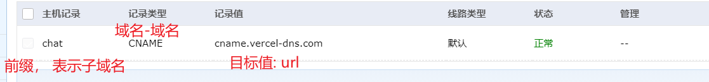
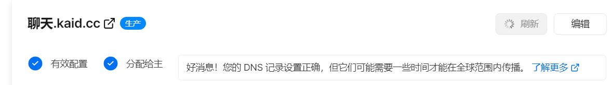
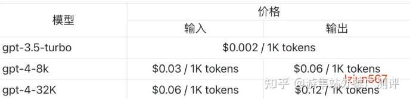

# 7.28 域名选择篇


# 🔺✨配置前须知

[搭建参考 视频](https://www.youtube.com/watch?v=oarA20sp0ck&t=581s)


> ChatGPT Next Web：
>
> 搭建技巧： 
> Vercel注册时  要求gitHub账户需要为- 谷歌邮箱！！ （提前改为主邮箱）
> 否则 注册失败
>
> api使用- 用于聊天 token  懂为什么别人大量卖账号
>
> 5美金 = 5元一个账户
>
> 
>
>
> 1. 需先fork项目
> 2. 傻瓜式一键操作
> 3. apiKey填入后， 在openAI菜单键， 用户下拉框 选择 view-api-key
> 	code- 设置密码 （登录验证）， 以 , 分割
>
> 4. 域名解析- 转换为自己的网站


## kaid.cc网站

kaid  : 也有头领的意义- cool 😎


域名：

DNS： 电话簿 

ip:  地址


DNS解析， 解析域名 - 抵达ip地址 


## .com  .cn  .cc  .top 

值钱， .cn常用于商业


### .cc

> 域名 ".cc" 实际上是科科斯（Keeling）群岛（Cocos (Keeling) Islands）的国家和地区顶级域名（ccTLD，Country Code Top-Level Domain），而不是代表日本。
>
> 科科斯群岛是位于印度洋的一个澳大利亚海外属地，其国家代码为 ".cc"。由于 ".cc" 在英文中也可以表示 "carbon copy"（抄送），因此一些网站也会将其用于域名注册，类似于 ".com" 和 ".net" 一样，表示商业或通用性质的网站。
>
> 日本的国家和地区顶级域名是 ".jp"，这是由日本政府和相关机构负责管理的。 ".jp" 常用于表示与日本相关的网站或企业，是日本国内和国际上广泛使用的域名后缀。
>
> 因此，".cc" 是科科斯群岛的国家和地区顶级域名，


### **.top**

> 域名 ".top" 是一个通用顶级域名（gTLD），并不代表任何特定的国家或地区。通用顶级域名是用于全球范围内的通用目的，不与特定的国家或地区相关联。
>
> ".top" 是在2014年推出的新通用顶级域名，其注册是开放的，意味着任何人都可以注册以 ".top" 结尾的域名，而不受国家或地区限制。由于其简洁明了的特点，".top" 域名在一些项目、公司或网站中被广泛使用，用于表示顶级、最高或最佳等含义。
>
> 虽然 ".top" 不属于任何特定的国家或地区，但它在全球范围内都可以注册和使用。因此，许多不同国家和地区的网站都使用 ".top" 域名作为其网站的后缀，而不仅限于特定国家。


## DNS（联系簿）- 域名 - IP（地址） 三者间关系


>   DNS（Domain Name System）是一种用于将域名转换为IP地址的系统，它建立了域名与IP地址之间的映射关系。DNS充当了互联网中的“电话簿”，它通过域名查找对应的IP地址，从而让计算机在互联网上相互通信。
>
> 具体来说，DNS和IP地址之间的关系是：DNS系统通过域名查询，将域名转换为相应的IP地址。当您在浏览器中输入一个域名，比如 "example.com"，浏览器会向DNS服务器发出查询请求，找到与该域名对应的IP地址，然后浏览器将使用该IP地址向服务器发送请求，以获取网站的内容并显示在浏览器中。
>
> 而DNS和域名之间的关系是：DNS系统是用来解析域名的系统。当您在浏览器中输入一个域名，DNS系统会根据域名查找对应的IP地址。域名是用来代表特定资源或服务的名称，比如网站、服务器等。通过使用域名，用户可以更方便地记忆和访问特定的资源，而无需记住复杂的IP地址。
>
> 总结：
> - DNS和IP地址之间的关系是DNS系统通过域名查询，将域名转换为相应的IP地址。
> - DNS和域名之间的关系是DNS系统用于解析域名，将域名转换为对应的IP地址，从而实现用户友好的域名访问。


## 一个域名所用拥有的子域名 无上限

> 一个域名理论上可以有无限多个子域名。子域名是在主域名之前添加的前缀，用于划分不同的子区域或子网站。子域名的设置是通过在DNS（Domain Name System）中添加相应的DNS记录来实现的。
>
> 举例说明，对于域名 "example.com"，可以设置多个子域名如下：
> - www.example.com
> - blog.example.com
> - shop.example.com
> - mail.example.com
> - api.example.com
>
> 您可以根据需要设置任意数量的子域名，以满足不同的业务需求或网站组织结构。不同的子域名可以指向不同的服务器、网站或应用程序，让您可以灵活地组织和管理您的网站内容。
>
> 虽然理论上子域名的数量没有限制，但实际上，域名的子域名设置通常受到域名注册商或DNS服务提供商的限制。有些服务提供商可能对子域名的数量或长度有一定限制。此外，大量的子域名设置也可能会对DNS服务器的性能产生影响，因此需要谨慎规划和管理子域名。
>
> 在实际应用中，一般情况下不会设置过多的子域名，几个或几十个子域名已经足够满足大部分网站的需求。如果您需要更多的子域名或有特殊的需求，建议您联系域名注册商或DNS服务提供商，了解相关的限制和规定。


### 子域名的设置 

> 在绝大多数情况下，域名是可以设置子域名的。子域名是指在主域名之前添加的前缀，例如，"subdomain.example.com"中的"subdomain"就是一个子域名。
>
> 设置子域名是通过在域名的DNS设置中添加相应的DNS记录来实现的。不同的DNS记录类型用于将子域名指向特定的IP地址或其他网络资源。这样，当用户在浏览器中输入子域名时，系统会解析该子域名的DNS记录，并将其指向相应的服务器或网站。
>
> 绝大多数域名注册商和DNS服务提供商都支持设置子域名。您可以通过登录到您的域名注册商或DNS服务提供商的控制面板，找到相应的域名设置选项，并添加子域名的DNS记录。
>
> 但是，值得注意的是，有极少数情况下，一些特殊的域名或某些域名注册商可能会限制或不支持设置子域名。此外，如果域名的所有者没有权限进行DNS设置或者域名解析服务不可用，那么就无法设置子域名。
>
> 因此，大多数情况下，域名是可以设置子域名的，并且设置子域名是非常常见的做法，让您可以根据需要创建多个独立的网站或服务。如果您有需要设置子域名的需求，建议您登录到您的域名注册商或DNS服务提供商的控制面板，并查找有关设置子域名的详细步骤和说明。


## A类DNS和顶级域名

> A类型的DNS记录是一种最常见的DNS记录类型之一，它用于将域名解析为IPv4地址。当您在浏览器中输入一个域名时，系统会查找该域名的A记录，然后将其转换为对应的IPv4地址，然后向该IPv4地址发送请求，以获取网站的内容并显示在浏览器中。
>
> 顶级域名（Top-Level Domain，TLD）是域名系统中的最高级别的域名。它位于域名的最右侧，是域名的最后一部分。常见的顶级域名包括 ".com"、".net"、".org" 等。顶级域名的选择对于域名的定位和使用有一定的意义。
>
> 意义如下：
> 1. 标识性：顶级域名可以传达网站的类型、所属地区或组织类型。例如，".com" 通常用于商业网站，".edu" 用于教育机构，".org" 用于非营利组织等。
>
> 2. 地域性：一些国家或地区拥有自己的国家代码顶级域名（Country Code Top-Level Domain，ccTLD），例如 ".cn" 代表中国，".uk" 代表英国。这些域名可以显示网站所属地区，有助于在本地市场中进行定位和识别。
>
> 3. 品牌保护：企业和品牌通常会注册与其品牌名称相对应的顶级域名，以保护其品牌在互联网上的形象和声誉。
>
> 4. SEO影响：某些搜索引擎对不同顶级域名的排名算法可能会有一些不同。例如，当搜索引擎用户在某个国家搜索时，该国家的顶级域名可能会在搜索结果中获得一定的优先权。
>
> 总的来说，选择合适的顶级域名对于网站的品牌定位、地域定位和SEO优化等方面都有一定的影响。因此，在注册域名时，选择适合自己网站定位和目标的顶级域名是值得考虑的重要因素。


## 域名与IP 关系

### 域名映射多个IP的作用

> 一个域名可以映射到多个IP地址，这种做法通常称为"DNS轮询"或"多个A记录"
>
> 
>
> 有多个IP地址映射到同一个域名的好处主要包括：
>
> 1. **负载均衡：**通过将一个域名映射到多个IP地址，可以实现负载均衡。当用户访问该域名时，DNS服务器会按照一定策略（如轮询、随机等）将用户的请求分发到不同的IP地址，从而平均分担服务器的负载，提高网站的性能和可靠性。
>
> 2. **容错性**：如果一个IP地址不可用或发生故障，仍然有其他IP地址可以提供服务。这提高了网站的容错性，即使某个服务器出现问题，用户仍然可以通过其他可用的IP地址访问网站。
>
> 3. **高可用性**：通过将一个域名映射到多个IP地址，可以实现高可用性。如果某个服务器不可用，DNS服务器会将用户请求重定向到其他可用的IP地址，确保网站始终可访问。
>
> 4. **分布式架构：**在一些大型分布式架构中，不同地区或数据中心可能有不同的服务器集群，通过将同一个域名映射到这些服务器的不同IP地址，实现更高效的请求处理。
>
> 需要注意的是，DNS轮询并不是最优的负载均衡方法，它没有考虑服务器的实际负载情况。更高级的负载均衡方法包括使用专业的负载均衡设备或软件，根据服务器的实际性能和负载情况来动态地分配请求。然而，DNS轮询是一种简单且易于实现的负载均衡方法，适用于一些简单的场景。


### DNS服务器解析 IP选择-   提升性能&用户体验

根据用户地理位置选择最优IP地址进行访问，需要使用其他高级的负载均衡技术，如全局负载均衡（GSLB）或内容分发网络（CDN），它们会根据用户的地理位置选择最近的服务器节点来提供服务。这些技术一般由专业的互联网服务提供商或网络服务商提供


**就是服务器有设置cdn， 选一个离我最近的服务器节点为我服务**

> 是的，您理解得很正确。当服务器使用CDN（内容分发网络）时，CDN会根据用户的地理位置选择最近的服务器节点为用户提供服务，从而实现更快的响应速度和更好的用户体验。
>
> CDN是一种分布式系统，它由多个服务器节点组成，这些节点分布在全球各地的数据中心或网络服务提供商中。当用户发起请求时，CDN会使用负载均衡算法来选择最近的服务器节点，这通常是通过测量用户和服务器节点之间的网络延迟（ping时间）来决定的。距离更近的服务器节点意味着数据传输的延迟更低，因此用户可以更快地获取网站内容。
>
> 使用CDN的好处包括：
>
> 1. 提高网站性能：CDN可以将网站的内容复制到多个服务器节点，使得用户可以从最近的节点获取内容，从而降低加载时间，提高网站性能。
>
> 2. 节省带宽：CDN可以分担主服务器的流量负担，减少对主服务器的直接访问，从而节省带宽资源。
>
> 3. 提高可靠性：由于数据复制到多个节点，即使某个节点出现故障，CDN仍然可以通过其他节点提供服务，提高了网站的可靠性和冗余性。
>
> 4. 全球覆盖：CDN的服务器节点遍布全球各地，可以为全球用户提供更稳定和快速的访问体验。
>
> 总结来说，CDN通过在全球多个节点复制网站内容，根据用户地理位置选择最近的节点为用户提供服务，提高了网站性能和可靠性，为用户带来更好的访问体验。


## Cname类型和A类型


> CNAME（Canonical Name）和A（Address）是两种不同的DNS记录类型，用于不同的目的：
>
> 1. CNAME记录：
> CNAME记录是一种别名记录，用于将一个域名指向另一个域名。它允许您在DNS中创建一个域名的别名，让一个域名指向另一个域名的解析结果。当您创建CNAME记录时，访问这个CNAME域名时，实际上会解析到目标域名的IP地址，然后访问目标域名的内容。CNAME常用于创建子域名或将一个域名指向主域名的情况。
>
> 例如，假设您在DNS中创建了以下CNAME记录：
> ```
> subdomain.example.com.  CNAME  maindomain.example.com.
> ```
> 那么访问 "subdomain.example.com" 时，DNS会解析到 "maindomain.example.com" 的IP地址，并将请求转发到 "maindomain.example.com" 上。
>
> 2. A记录：
> A记录是一种地址记录，用于将域名解析为IPv4地址。当您创建A记录时，直接将域名映射到一个具体的IPv4地址。这使得当用户访问该域名时，DNS会直接返回与域名对应的IPv4地址，然后浏览器会使用该IP地址发送请求，以获取网站的内容并显示在浏览器中。
>
> 例如，假设您在DNS中创建了以下A记录：
> ```
> example.com.  A  203.0.113.1
> ```
> 那么访问 "example.com" 时，DNS会直接返回IPv4地址 203.0.113.1，然后浏览器会通过该IP地址访问网站的内容。
>
> 总结：
> - CNAME记录用于创建域名的别名，将一个域名指向另一个域名的解析结果。
> - A记录用于将域名直接解析为IPv4地址，将域名映射到一个具体的IP地址。


## CNAME 绕过国外限制的原理

**悟：** 

域名指向， chat.kaid.cc 指向的目标为 国外服务器DNS解析器， 再由解析器去进行解析国外域名， 由于国外服务器（**网站-应用**）识别的解析者为  国外DNS解析服务器（不受限制），所以能绕过检测

> 相当于访问时是访问国外DNS服务器，然后由服务器再转发到目标网站， 目标网站所识别的为国外DNS服务器， 相当于一个绕检测


- 国外DNS服务器在互联网上并没有受到内地的网络限制，它能够正常解析域名并获取对应的IP地址

> 直接请求- Vercel   被拒绝
>
> 域名解析  - >国外DNS 服务器  -> 应用  （success） 


 **原不解：**

直接访问， 和域名访问的区别， 还是不能理解为什么能绕过访问

> 我理解您的疑问。让我们来澄清一下：
>
> 1. 直接访问 vs. 域名访问：
> - 直接访问：指直接使用 IP 地址访问网站或应用，例如通过输入 "http://xxx.xxx.xxx.xxx"（xxx.xxx.xxx.xxx 为目标网站的 IP 地址）来访问。
> - 域名访问：指通过域名来访问网站或应用，例如通过输入 "http://example.com"（example.com 为域名）来访问。
>
> 2. 绕过访问限制：
> 对于国内用户访问某些国外的应用或网站，由于防火墙或其他网络限制，直接访问可能会受到限制，导致无法正常连接。然而，通过将域名解析指向国外服务器，例如使用 CNAME 记录将域名解析到 Vercel 平台（国外应用），可以绕过部分国内网络限制，从而实现在国内无需翻墙即可访问该应用的效果。
>
> 绕过的原因是因为国内的网络限制通常是根据 IP 地址进行的，而通过域名解析指向国外服务器，使用国外 IP 地址进行访问，从而绕过了直接使用国外 IP 地址访问所受到的限制。
>
> 需要注意的是，使用此方法绕过访问限制可能涉及到一些合规和法律问题，具体取决于所访问的内容和国家的相关规定。确保您的操作合法合规，不违反任何法律法规是非常重要的。


懂了， 相当于访问时是访问国外DNS服务器，然后由服务器再转发到目标网站， 目标网站所识别的为国外DNS服务器， 相当于一个绕检测， 所以在内地能使用


> 您理解得非常正确！
>
> 是的，当您将域名解析指向国外DNS服务器（如Vercel提供的DNS服务器）后，用户在内地访问您的网站时，请求首先会被发送到国外DNS服务器。由于国外DNS服务器在互联网上并没有受到内地的网络限制或防火墙影响，它能够正常解析域名，并将请求转发到Vercel平台或目标网站。
>
> 在目标网站看来，请求来自于国外DNS服务器的IP地址，而不是来自内地的用户。这样就绕过了内地的网络限制，实现在内地能够直接访问目标网站的效果。
>
> 请注意，绕过网络限制可能涉及到法律和合规问题，取决于您访问的内容和所在的国家或地区的规定。确保您的操作合法合规，并遵守当地的法律法规是非常重要的。同时，也要注意不同网络环境和政策可能发生变化，因此最好随时了解相关信息和政策更新。


## 🔺✨配置成功~






## 服务器与域名

> 购买服务器相当于购买了一个独立的IP地址，并且您可以将该IP地址与域名绑定，从而实现对您的web端应用进行部署和访问。
>
> 具体的流程如下：
>
> 1. 购买服务器：首先，您需要选择一个服务器提供商或云服务提供商，并购买一个服务器。通常，您可以选择虚拟私有服务器（VPS）或云服务器等不同类型的服务器，这些服务器都会分配一个独立的公共IP地址给您使用。
>
> 2. 获取服务器IP地址：一旦购买服务器成功，服务器提供商会向您提供服务器的IP地址。这个IP地址是您的服务器在互联网上的唯一标识，它是用来访问和部署您的web应用的。
>
> 3. 绑定域名：接下来，您可以在域名注册商处购买一个域名，并将该域名绑定到您的服务器IP地址上。这个过程通常是在域名管理界面设置DNS记录，将域名解析到服务器的IP地址。
>
> 4. 部署web应用：一旦域名与服务器IP地址绑定成功，您可以将您的web应用部署到服务器上。您可以通过SSH或其他远程连接方式登录到服务器，上传您的web应用文件，并进行配置和安装。
>
> 5. 访问您的web应用：现在，您的web应用已经部署在服务器上，并与域名绑定。当用户在浏览器中输入该域名时，DNS解析会将域名转换为服务器的IP地址，然后用户的请求将被发送到您的服务器，从而访问您的web应用。
>
> 通过这个流程，您可以实现将域名与服务器IP地址关联起来，从而让用户通过域名访问您的web应用，而不是直接使用IP地址。这样更加方便用户记忆和访问，并提供了更好的用户体验。


## API使用 计算




GPT3.5价格非常便宜，1000个token的价格是0.002美元

一字 约 = 2.3 token


单次请求-答复   -  平均算长度时 =  500字

500字  约等于  1000token   = 0.002美元 =  1次 请求答复


1美元 = 6元 = 500次答复   

5美元 = 2500次答复    


账号出售- 一般免费额度30次   约0.36元-  倒还好，引流-   一个用户撑死月用 10元

​		但是充值会员费用时  = 正常为30元  

大部分人  max请求   - 80条     1元左右   

​	max的最大月使用时     就相当于 月用  5美元

​     


但是  先抢占蛋糕者： 批发造号 - 卖也罢，  使用api 接口形式卖也好， 大部分0成本（理想）


5美元额度时：	人赚30元

如果初始为18美元账号时 =>  108元


无限裂变： 一条号能产能- 理想化   

就单从	初始购号时： 1号 108元，  批发造号， 1000条 = 10万 


api供能一回事， 在初期就单卖号： 单号值 ->  	40~ 50元     5万 

再做个操盘手教程 - 教人 - 一人收学费  5000元， 教10人   5万


短期增益很可怕， 后期就运营， 一个人头 = 20元固定， 500个每月使用， 所带来的效益就有10000元


